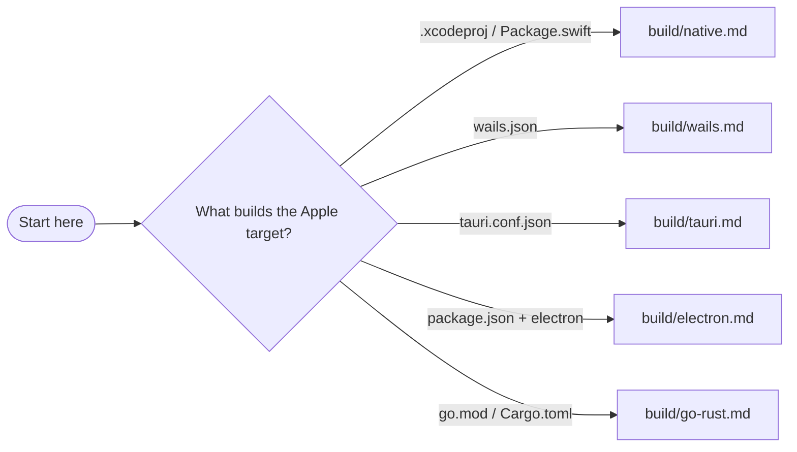

# Shipping Darwin Apps

Use this for any work that builds or ships an app targeting iOS or macOS, regardless of the source language (native Swift/ObjC, Wails, Tauri, Electron, Go, Rust). This is the routing hub: it tells you which reference doc to read based on what is in the repo and what you are doing.

This skill replaces `apple-platform-readiness`, `ios-testflight-release`, and `macos-release`. Their content lives in the supporting files below.

## Guardrails (always apply, no exceptions)

- **Never** print, commit, upload, or paste private keys, `.p8` files, certificates, provisioning profiles, `.p12`, `.xcarchive`, `.ipa`, `.dmg`, or exported app bundles.
- **Never** print certificate passwords, app-specific passwords, API keys, base64 certificate payloads, temporary keychain passwords, or notarization credentials.
- **Never** submit to App Store review, publish publicly, change bundle identifiers, rotate credentials, or alter account/team settings without explicit approval. Internal TestFlight upload may proceed only when the user authorized release automation.
- Treat Apple Developer Team IDs, bundle IDs, and App Store Connect app IDs as project configuration. Do not hard-code personal examples into public docs.
- Check `git status` before touching unrelated workflow, signing, version, or project changes.
- If a signing identity's private key is missing, **STOP**. A certificate alone cannot produce a usable signature.

## Route to the right doc

Read only what you need. Start here, then open the doc the repo signal points to.

**If the environment is uncertain, or this is a project's first release,** start with [readiness.md](./readiness.md) to understand what is checked and installed.

**Detect the build doc from the repo:**

| Repo signal | Read |
|---|---|
| `.xcodeproj` / `.xcworkspace` / `project.yml` / `Package.swift` | [build/native.md](./build/native.md) |
| `wails.json` or Wails in `go.mod` | [build/wails.md](./build/wails.md) |
| `tauri.conf.json` | [build/tauri.md](./build/tauri.md) |
| `package.json` with electron / electron-builder | [build/electron.md](./build/electron.md) |
| `go.mod` / `Cargo.toml` producing a `.app`/`.dmg` | [build/go-rust.md](./build/go-rust.md) |

**Detect the ship doc from the distribution target:**

| Distribution target | Read |
|---|---|
| iOS via App Store / TestFlight | [ship/appstore.md](./ship/appstore.md) |
| macOS outside the App Store (Developer ID, notarization) | [ship/direct.md](./ship/direct.md) |

**Only ask the human when the repo cannot answer it:** is this release or debug? which distribution channel? real release or dry run? Use repo signals for everything else.

## Framework routing

## Quick reference

| What you are doing | Necessary command |
|---|---|
| Build a native Xcode app | `xcodebuild archive -scheme <scheme> -archivePath <path>` |
| Build a Wails app | `wails3 build` / `task package:<os>` |
| Build a Tauri app | `npm run tauri build` |
| Build an Electron app | `npx electron-builder --mac` |
| Sign (Developer ID) | `codesign --force --options runtime --timestamp --sign "<identity>" <app>` |
| Notarize | `xcrun notarytool submit <file> --apple-id ... --team-id ... --password ... --wait` |
| Staple + verify | `xcrun stapler staple <file>; xcrun stapler validate <file>` |
| Gatekeeper assess (app/DMG) | `spctl --assess --type execute --verbose=4 <app>` / `--type open --context context:primary-signature <dmg>` |

Cross-reference: reusable `workflow_call` contracts live in the `gh-workflows` skill in the `vuon9/gh-workflows` repo.
